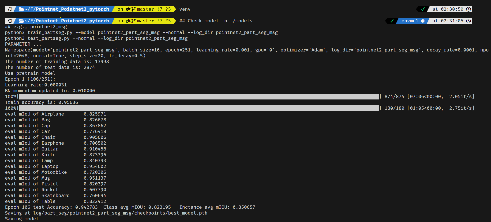

# Week 2

## concept learning

continue learned CNN

## environment build

- [ ] All environments have set up
  - [x] PyTorch
  - [x] PointNet
  - [x] CUDA
  - [x] Issac Sim
  - [ ] [PoseCNN](./PoseCNN.md)

replicate Pointnet

## challenges

- environment not set
  -  `export PATH=/usr/local/cuda/bin${PATH:+:${PATH}}`
- buil

## problems

- Since the dependencies for `poseCNN` are too old, I might need to create another virtual environment
