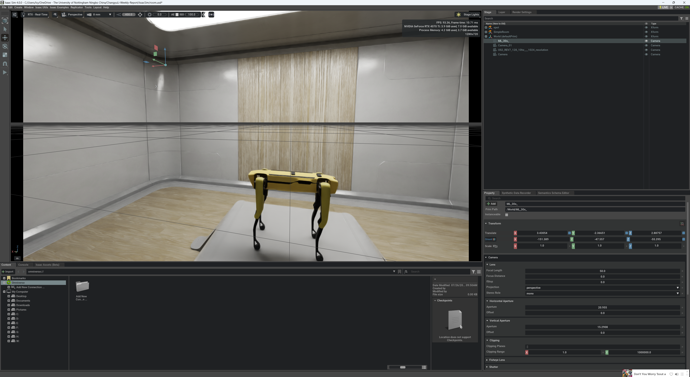

# week5

## Preparing data for training: in progress

I added cameras and lidars at the object.

### Preparing: Install ROS to visulize lidar result

[RViZ visualization](https://docs.omniverse.nvidia.com/isaacsim/latest/ros_tutorials/tutorial_ros_rtx_lidar.html)

`./python.sh standalone_examples/api/omni.isaac.debug_draw/rtx_lidar.py Example_Rotary`

